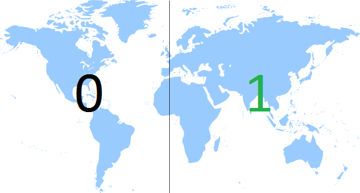
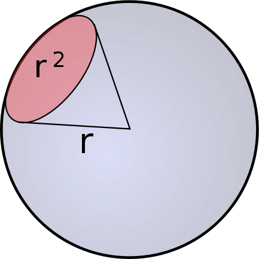

[](https://travis-ci.org/wenhao/geohash)

## [GeoHash](https://github.com/wenhao/geohash)



1. 坐标转换成52bit二进制编码值。

    * 52bit精度在0.6m足够满足搜索范围需求。
    * 算法，根据经纬度计算GeoHash二进制编码：
    
        * 首先将纬度范围(-90, 90)平分成两个区间(-90, 0)、(0, 90)， 如果目标纬度位于前一个区间，则编码为0，否则编码为1.
        * 经度也用同样的算法，对(-180, 180)依次细分.
        * 接下来将经度和纬度的编码合并，奇数位是纬度，偶数位是经度. 

2. 估算搜索范围起始值。
    
    52bit把地球总面积等分成2^26(2的26次方)个区域, 每个区域大小等于0.6mX0.6m的正方形面积. 同理如果采用30bit,就是把地球等分成2^15个区域, 每个区域大小等于1222mX1222m.
    
    

    * 算法, 如果用52位来表示一个坐标, 那么总共有: 2^26 * 2^26 = 2^52 个框:
    
        * 地球半径：radius = 6372797.560856m
        * 每个框的夹角：angle = 1 / 2^26 (2的26次方)
        * 每个框在地球表面的长度: length = 2 * π * radius * angle
        
            位数         | 精度 
            ------------ | -------------
            52bit | 0.59m
            50bit | 1.19m
            30bit | 1221.97m
            28bit | 2443.94m
            26bit | 4887.87m
            24bit | 9775.75m

3. 给出查询的中心坐标并计算其GeoHash值(52bit)。

4. 计算中心坐标相邻的8个坐标(中心坐标在两个框边界会有误差，此规避误差)。

5. 加上中心坐标共9个52bit的坐标值，针对每个坐标值参照搜索范围值算出区域值[MIN, MAX]。
    ```java
    //搜索距离坐标(30.5464140000, 104.0748220000)3千米内9个候选范围坐标
    List<GeoRange> geoRanges = GeoSearch.range(30.5464140000, 104.0748220000, 3000);
    ```
    * 算法：MIN为坐标的搜索指定位起始长度后补零；MAX为坐标的搜索指定位终止长度后+1再补零。
    
6. 使用Redis命令ZRANGEBYSCORE key MIN MAX WITHSCORES查找。

7. 避免误差按照距离公式在将所有结果过滤一次(GeoHash反坐标再计算距离)。
   
   
### 使用方式

#### 安装

Maven仓库

[https://oss.sonatype.org](https://oss.sonatype.org/#nexus-search;gav~com.github.wenhao~geohash~~~)

##### Maven

```xml
<dependency>
  <groupId>com.github.wenhao</groupId>
  <artifactId>geohash</artifactId>
  <version>1.0.0</version>
</dependency>
```

##### Gradle

```groovy
repositories {
  mavenCentral()
}

dependencies {
  compile(
    "com.github.wenhao:geohash:1.0.0",
  )
}
```

####Example

#####需求

   搜索2千米内所有的嘀嘀司机
    
#####实现

1. 乘客坐标30.5464140000, 104.0748220000

2. 嘀嘀司机不断地向Redis更新自己的坐标
   假如司机坐标为30.5388942218,104.0555758833
   
   ```java
    GeoHash geoHash = GeoHash.fromCoordinate(30.5388942218,104.0555758833)
    //4024744861876082L
    long longValue = geoHash.toLong();
   ```

   ```
   ZADD didiDriver 4024744861876082 driverId
   ```
3. 乘客在搜索司机时先录入自己坐标到Redis
   
   ```
   ZADD passenger 4025111557750656 passengerId
   ```

4. 2千米内计算出9个搜索范围

   ```java
   List<GeoRange> geoRanges = GeoSearch.range(30.5464140000, 104.0748220000, 2000);
   ```
5. 针对每一个搜索GeoRange范围调用Redis

   ```java
   double min = geoRange.min();
   double max = geoRange.max();
   ```
   
   ```  
   ZRANGEBYSCORE didiDriver min max WITHSCORES
   ```
6. 最后使用距离公式刷选结果
   
    ```java
    GeoHash geoHash = GeoHash.fromLong(4024744861876082L);
    double distance = geoHash.distance(30.5464140000, 104.0748220000);
    if(distance < 2000){
        //....
    }
    ```
    
此算法也可以使用其他的数据库如MySQL等.